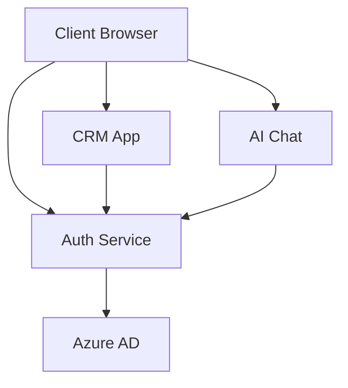
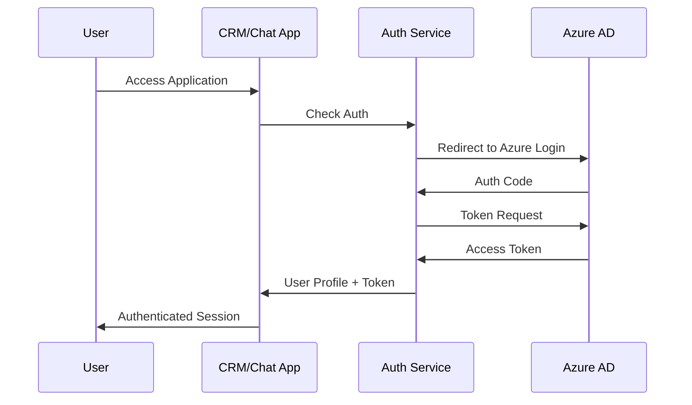
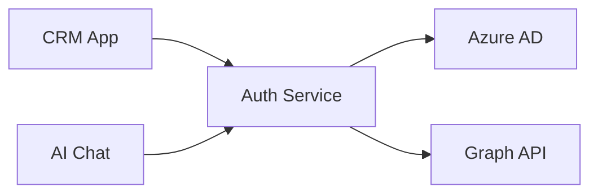
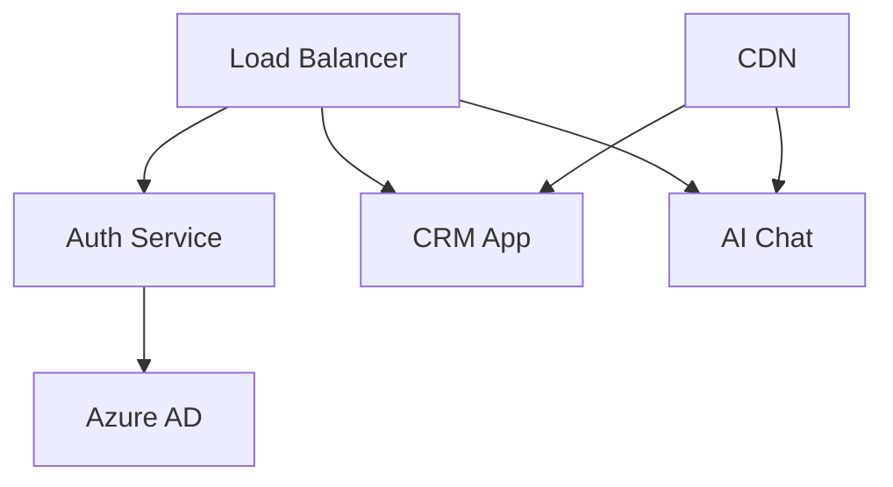

# Nexus360 System Design

## System Architecture

### Overview
Nexus360 is a microservices-based platform integrating multiple business applications with centralized authentication.



### Components

#### 1. Auth Service (Port 3006)
- Azure AD integration
- Token management
- User profile handling
- CORS configuration
- Security middleware

#### 2. CRM App (Port 3010)
- React-based frontend
- Deal management
- Product catalog
- User interface
- Authentication integration

#### 3. AI Chat (Port 3020)
- Chat interface
- AI integration
- Real-time communication
- Authentication integration

## Authentication Flow



## Data Flow

### Authentication Data
```typescript
interface AuthToken {
    accessToken: string;
    expiresAt: number;
    refreshToken?: string;
}

interface UserProfile {
    id: string;
    displayName: string;
    email: string;
    jobTitle?: string;
}
```

### Storage Strategy
- Tokens: Secure localStorage
- User Profile: localStorage
- Application State: React Context
- API Cache: Memory

## Security Architecture

### Authentication
- Azure AD SSO
- Token-based auth
- Secure token storage
- Automatic token refresh

### Authorization
- Role-based access
- Resource-level permissions
- Scope validation
- Token validation

### Data Protection
- HTTPS everywhere
- CORS protection
- XSS prevention
- CSRF protection

## Integration Patterns

### Service Communication


### Event Flow
1. Authentication Events
2. Profile Updates
3. Session Management
4. Error Handling

## Scalability Design

### Horizontal Scaling
- Stateless services
- Load balancing
- Session management
- Cache strategy

### Vertical Scaling
- Resource optimization
- Performance monitoring
- Database indexing
- Query optimization

## Monitoring & Logging

### Health Checks
- Service status
- Authentication status
- API availability
- Resource usage

### Logging Strategy
- Centralized logging
- Error tracking
- Performance metrics
- User activity

## Development Architecture

### Project Structure
```
nexus360/
├── apps/
│   ├── crm/
│   └── ai-chat/
├── services/
│   ├── auth-service/
│   └── shared/
├── packages/
│   ├── ui/
│   └── utils/
└── docs/
```

### Development Flow
1. Feature branches
2. Local development
3. Testing environment
4. Production deployment

## Error Handling

### Strategy
- Global error handling
- Service-specific errors
- User-friendly messages
- Error logging

### Error Types
```typescript
interface AppError {
    code: string;
    message: string;
    details?: any;
}
```

## Performance Optimization

### Frontend
- Code splitting
- Lazy loading
- Cache management
- Bundle optimization

### Backend
- Response caching
- Query optimization
- Connection pooling
- Resource management

## Future Considerations

### Planned Features
1. Additional services integration
2. Enhanced security features
3. Advanced monitoring
4. Performance improvements

### Scalability Plans
1. Service mesh implementation
2. Container orchestration
3. Global distribution
4. Cache optimization

## Technical Specifications

### Technology Stack
- Frontend: React, TypeScript, Vite
- Backend: Node.js, Express
- Authentication: Azure AD
- Tools: pnpm, ESLint, Jest

### Infrastructure Requirements
- Node.js 16+
- SSL certificates
- Azure subscription
- Development tools

## Deployment Architecture

### Production Environment


### Deployment Strategy
1. Blue-green deployment
2. Rolling updates
3. Automated rollback
4. Health monitoring

## Documentation

### Technical Documentation
- API documentation
- Component documentation
- Integration guides
- Deployment guides

### User Documentation
- User guides
- Admin guides
- Integration guides
- Troubleshooting guides
